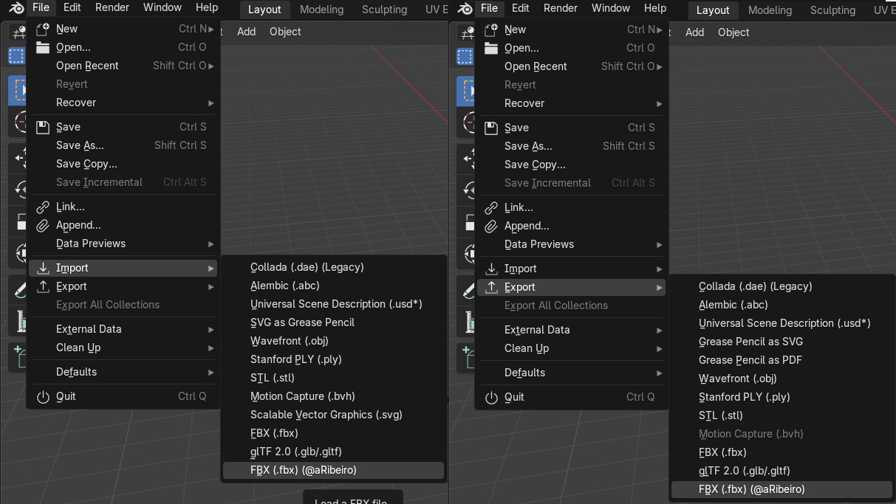

# Custom Blender FBX Format Importer/Exporter

> For this is how God loved the world:  
he gave his only Son, so that everyone  
who believes in him may not perish  
but may have eternal life.  
  \
John 3:16

# Context & Motivation

Very recently I developed a plugin for Unity3D to deal with animation root motion. You can check the asset url: [http://u3d.as/2F6K](http://u3d.as/2F6K).

When I was dealing with exported animations to test the plugin I developed, I discovered that the Blender's exporter comes with two limitations: It does export a ghost root bone called 'Armature' and it does import one keyframe ahead of frame 0.

I made the modification in my Blender's installation and now I'm sharing the code here.

### First Problem With Blender FBX Exporting

I extracted the textures using [Blender](https://www.blender.org/).

When I tried to export only the mesh with the rig, I got an additional empty root bone in the hierarchy called 'Armature'.

The model I export is different from the model I imported...

This is incompatible with the [Unity](https://unity.com/) animation system, because the other animation files need to match the bone hierarchy.

Worst: when I turn on the 'Key All Bones' option in the current FBX exporter (2021), it creates an animation curve for the 'Armature' (the undesired root bone). This causes the [Unity](https://unity.com/) native root motion to stop to work.

This is not a fault of the original developers, because the [Blender](https://www.blender.org/)'s API exposes the struct the plugin uses to export.

The 'Armature' is part of the [Blender](https://www.blender.org/)'s data. And the original exporter just exports it as it gets from the API.

This image below shows the original model from [Mixamo](https://www.mixamo.com/) on the left side and the exported model from [Blender](https://www.blender.org/) default FBX exporter.


### Second Problem (On Import)

When we import from the current FBX, the importer adds 1 to every keyframe number on the [Blender](https://www.blender.org/)'s timeline.

This causes the animation to have a 'hiccup' when we need to export it back.

The animation import problem is on top of the image and the correct animation frames position is on the bottom of the image.


# The Custom Exporter

I got the code from the [Blender](https://www.blender.org/) installation and started to search for the places (hierarchy and keyframe) we need to modify.

You can edit the files in the [Blender](https://www.blender.org/)'s installation folder.

On Windows the files are:

```
C:\Program Files\Blender Foundation\Blender {Blender Version}\{Blender Version}\scripts\addons\io_scene_fbx\export_fbx_bin.py
C:\Program Files\Blender Foundation\Blender {Blender Version}\{Blender Version}\scripts\addons\io_scene_fbx\import_fbx.py
```

On Linux the files are:

```
/usr/share/blender/{Blender Version}/scripts/addons/io_scene_fbx/export_fbx_bin.py
/usr/share/blender/{Blender Version}/scripts/addons/io_scene_fbx/import_fbx.py
```

On MacOS the files are:

```
/Library/Application Support/Blender/{Blender Version}/scripts/addons/io_scene_fbx/export_fbx_bin.py
/Library/Application Support/Blender/{Blender Version}/scripts/addons/io_scene_fbx/import_fbx.py
```

The hierarchy itself was the most difficult part to figure out how to solve compared to the import part.

### MODIFICATIONS ON export_fbx_bin.py

I removed all [Blender](https://www.blender.org/)'s Armature from the object list to export:

```python
    # Objects (with classical parenting).
    for ob_obj in objects:
        # [Alessandro] Remove Armature node from export
        if ob_obj.type == 'ARMATURE':
            continue
        ...
```

I added a code to check if the bone being exported is the real root bone (attached to the 'Armature' as its parent) and added it to the FBX without a parent node:

```python
    # Armature & Bone chains.
    for bo_obj in data_bones.keys():
        par_obj = bo_obj.parent
        # [Alessandro] Set the parent of root null from the first parent bone... not the Armature
        if (not par_obj is None) and par_obj.type == 'ARMATURE':
            connections.append((b"OO", bo_obj.fbx_uuid, 0, None))
            continue
        ...
```

Finally I changed the animation name by removing the 'Armature|' from its beginning:

```python
    def add_anim(animations, animated, anim):
        nonlocal frame_start, frame_end
        if anim is not None:
            # [Alessandro] Remove 'Armature|' animation name...
            _astack_key, astack, _alayer_key, _name, _fstart, _fend = anim

            _name = _name.decode("utf-8")
            if _name.startswith("Armature|"):
                _name = _name[9:]
            _name = _name.encode("utf-8")

            animations.append((_astack_key, astack, _alayer_key, _name, _fstart, _fend))
        ...
```

### MODIFICATIONS ON import_fbx.py

I decremented 1 frame index in the keyframe insertion part:

```python
    # Add each keyframe to the keyframe dict
    def store_keyframe(fc, frame, value):
        fc_key = (fc.data_path, fc.array_index)
        if not keyframes.get(fc_key):
            keyframes[fc_key] = []
        # [Alessandro]
        keyframes[fc_key].extend((frame-1, value))
```

### Feel Free to Make Your Own Modifications

I marked with the text `# [Alessandro]` in all the parts I changed in the source code.

If you don't want to install this version, you can do the changes by yourself.

I hope it can be useful.

# How To Install On Blender

1. Download the [current release zip file](https://github.com/A-Ribeiro/CustomBlenderFBXExporter/releases) from GitHub.

2. Open Edit > Preferences...


3. Click Add-ons


4. Click on Testing


5. Click on Install and select the release file you downloaded.


6. Click on the checkbox to enable the Add-on


### Check Add-on Is Installed Correctly

You can check if the add-on is installed correctly if you see the '@aRibeiro' in the import/export menu of the [Blender](https://www.blender.org/) as shown in the image below:


